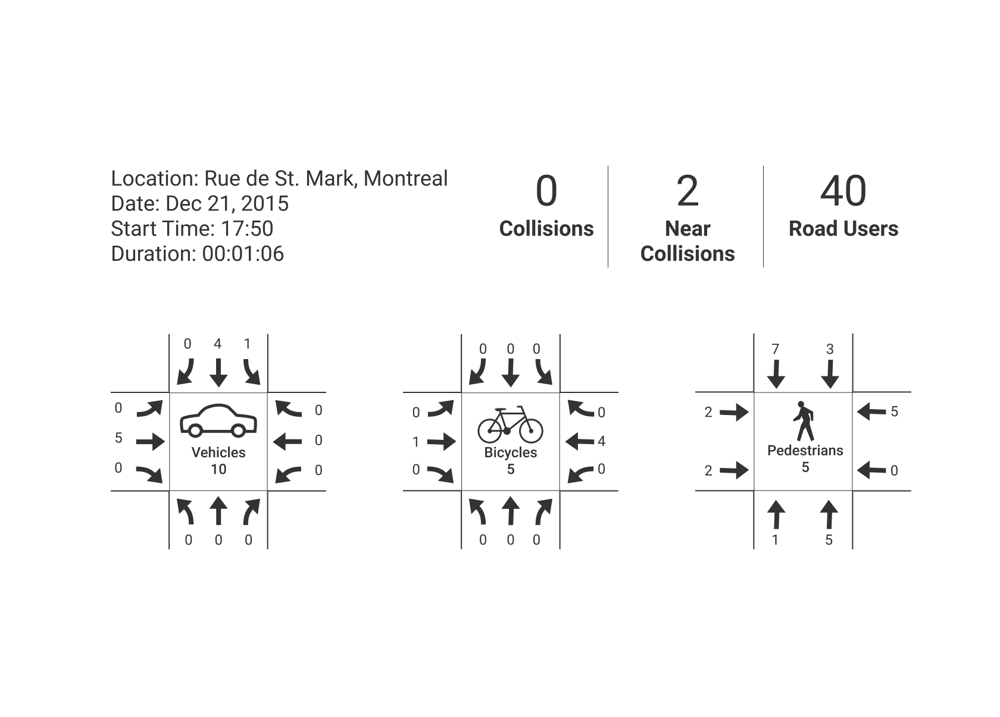
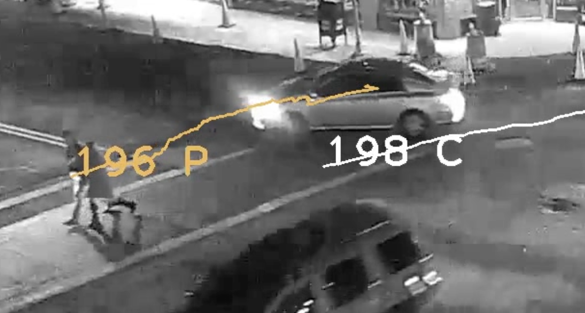

# Santos Platform

Santos Platform is a cloud-based software platform that provides citizens, who are concerned with traffic safety, access to safety metrics from visual traffic data.

## Concerned citizens and city officials can start conversations about improving roads with quantitative evidence.
Safety reports can be shared easily amongst citizens and city officials.

 

## Identifying near miss incidents can be informative without the injury or loss of life.
Near-collision events are more frequent and their analysis is more useful than actual crash statistics in detecting systemic safety problems.

 

## Visual traffic data can be recorded from phone cameras, GoPros, or home security cameras.
The computer vision that tracks the trajectories of pedestrians, bicyclists, and vehicles has been tested with all of these devices.  When anyone in the community can collect traffic data, cities will be better at measuring and managing the traffic safety of their streets.
