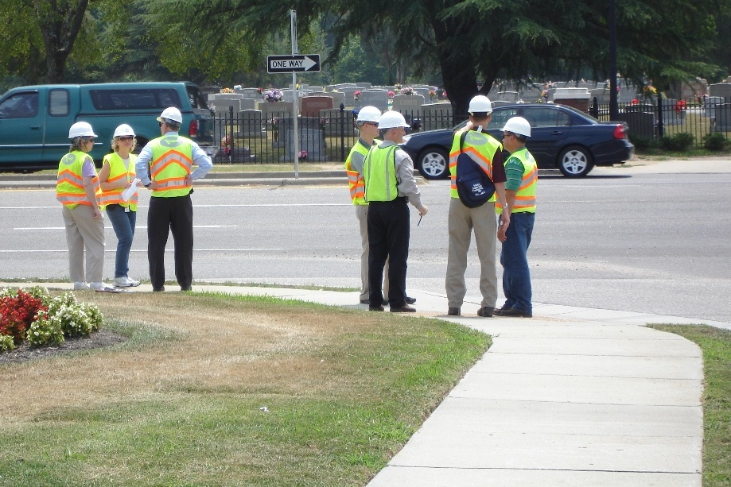
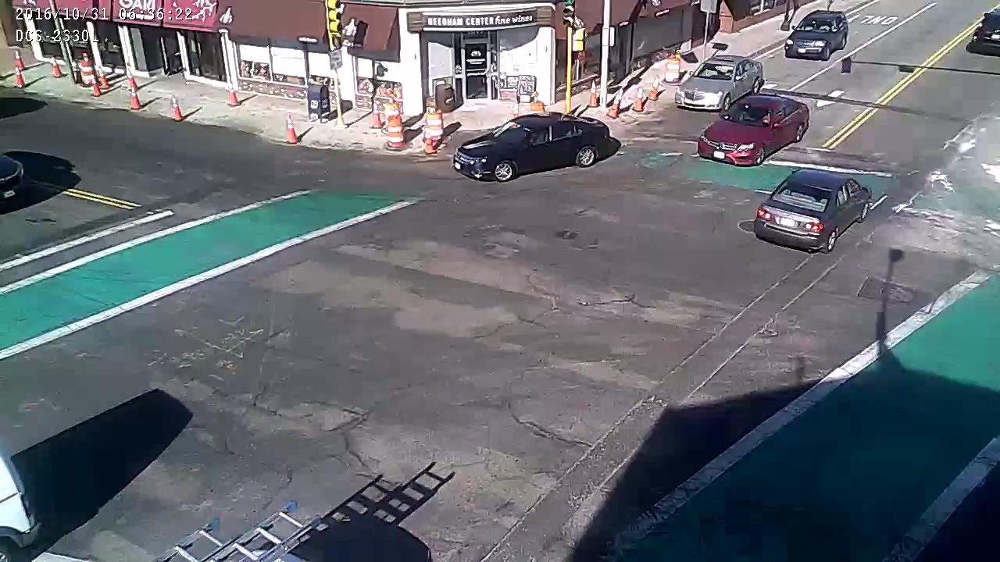
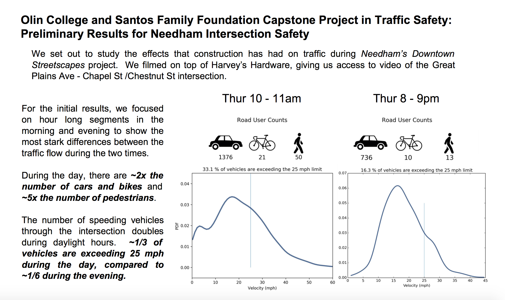
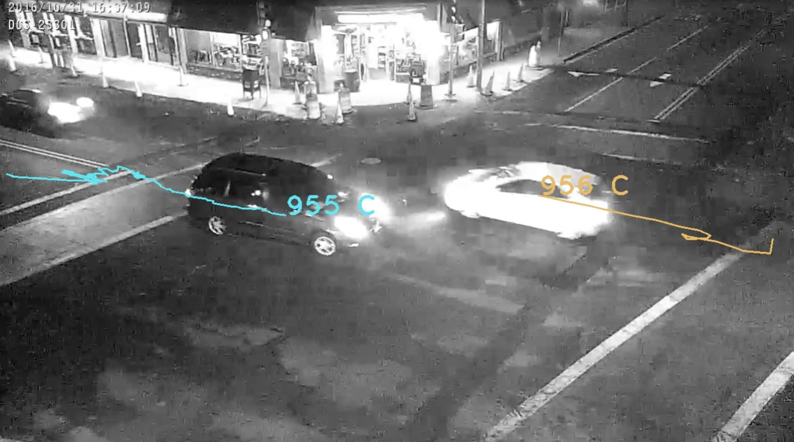
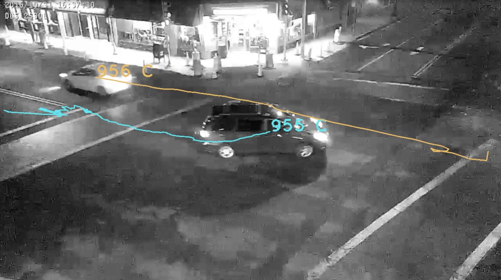

# Improving Transportation Safety through Data-Driven Technologies 

Many of us can think of an intersection in our towns and cities where traffic feels unsafe. The impact of unsafe roads is felt by every road user, from drivers, bikers, and pedestrians. Realize that every year, there are more than 30,000 traffic fatalities in the United States.  Several of those fatalities might happen this year at the intersections we have in mind.

People already engaged in improving infrastructure can create safer intersections more quickly if they had access to affordable traffic data.

 

Santos Platform is a cloud-based software platform that provides those who are concerned with traffic safety access to safety metrics from visual traffic data.

## Anyone can participate in collecting metrics that will lead to measurable change
Our software works with video footage recorded on many different devices.  All someone needs is to start recording from a second-story view point. 

 

## Concerned citizens and city officials can start conversations about improving roads with quantitative evidence.
Safety reports can be shared easily amongst citizens and city officials.

 

## Identifying near miss incidents can be informative without injury or loss of life.
Near-collision events are more frequent and their analysis is more useful than actual crash statistics in detecting systemic safety problems.

 

